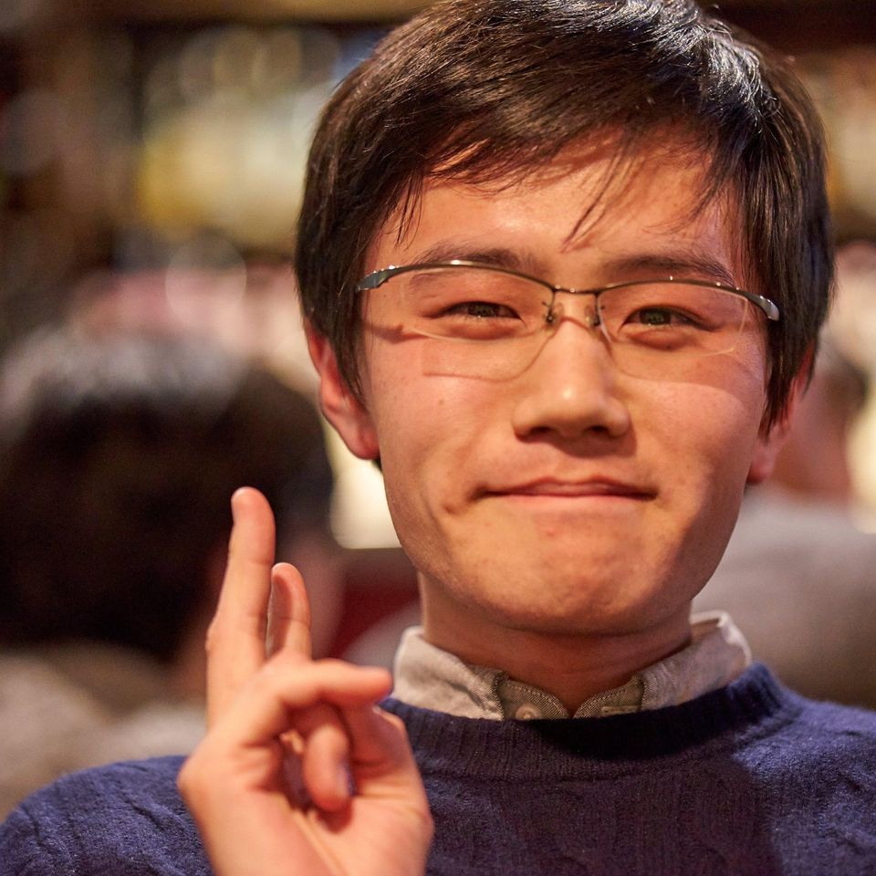

# kazuyuki8

大友　和幸

## 技術
### 統計検定　2級
> - 基礎的な仮説検定や線形回帰などを中心に学習
> - [公式HP 統計検定2級](https://www.toukei-kentei.jp/about/grade2/)

### Deep Learning for NLP サマースクール(東大松尾研主催) 修了
> - LSTMやTransformerなどの原理について学習
> - PyTorchを使用してそれらを実装
> - [公式HP NLPサマースクール](https://deeplearning.jp/deep-learning-for-nlp-2020s/)

### その他
Python, PyTorch, R
## 学歴

### 慶応大学 環境情報学部(2016 - )

> 安宅和人研究会(2018 - )
>  - 検索クエリデータの分析

> 上山信一研究会(2018 - 2019)
>  - 経営戦略立案　マーケティング
>  - 購買ログデータの分析

### 埼玉県立川越高校(2012 - 2015)
> 物理部

## 興味分野
- データ分析, 機械学習, 深層学習, 自然言語処理
- 経営戦略, マーケティング

## 趣味

> 料理
>- イタリアン、魚料理が中心

> レコード収集
>- ジャズ, クラシック

> 読書
>- 村上春樹, カズオ・イシグロ, カート・ヴォネガット, 老子

> カメラ
